# MyAika User Guide

Last updated: February 18, 2026

## Purpose
This guide is a complete, tab-by-tab walkthrough of MyAika. It explains what each feature does, why you would use it, and how to use it safely and effectively. It also includes step-by-step scenarios for the trading stack.

This is an educational guide and not financial advice. Always use paper mode first and never trade money you cannot afford to lose.

## Quickstart
1. Install dependencies: `npm install`
2. Start the server: `npm run dev:server`
3. Start the web UI: `npm run dev:web`
4. Open the UI: `http://localhost:3000`

If you are on iPad/Safari, microphone access requires HTTPS. Use `npm run dev:ipad` or `npm run dev:web:https`.

## Navigation Map (Top Tabs)
- `Chat`: Conversational UI, voice control, and general assistant use.
- `Recordings`: Meeting Copilot for recording, transcription, and meeting notes.
- `Aika Tools`: Structured tools for notes, todos, calendar, email, memory, and messaging.
- `Tools`: MCP-lite tool browser, direct tool execution, approvals, and history.
- `Action Runner`: Browser automation plus Desktop mode (local control) with approvals and artifacts.
- `Teach Mode`: Record and run reusable browser macros.
- `Fireflies`: Fireflies meeting sync, RAG Q&A, and knowledge graph.
- `Trading`: Full trading terminal with paper, backtest, options, knowledge RAG, and scenarios.
- `Safety`: Autonomy controls, approval rules, kill switch, and audit log.
- `Canvas`: Live cards that Aika updates from server events.
- `Features`: MCP discovery and Connections portal.
- `Settings`: Integrations, Skills, Trading preferences, Appearance, and Voice controls.
- `Debug`: System health, voice pipeline checks, and logs.
- `Guide`: This user guide in-app.

## Global Concepts
- Local-first: Most state (memory, recordings, RAG, audit logs) stays in `data/` locally.
- Safety-first: Risky actions are deny-by-default and require approvals.
- RAG: Retrieval-augmented generation is used for Fireflies and Trading knowledge.
- Hybrid RAG: Semantic embeddings + lexical FTS to improve recall.
- Approvals: High-risk actions route through approvals before execution.

## Chat Tab
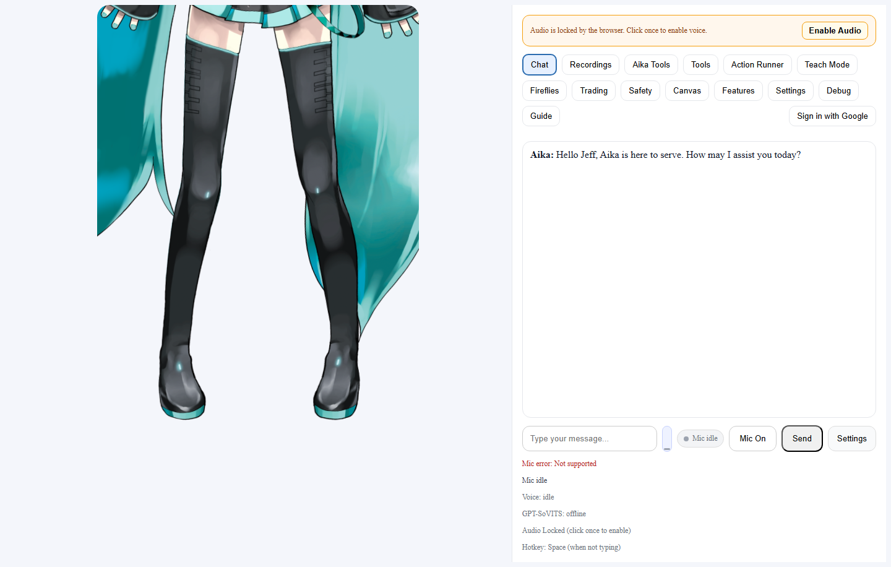

### What it is
The main conversational workspace for text and voice interactions with Aika.

### Key functions
- `Text chat`: Type a prompt and press Enter or click `Send`.
- `Voice chat`: Click `Mic On` or press `Space` to start listening.
- `Voice status`: Mic indicator shows `Mic active`, `Mic idle`, or `Mic off`.
- `Feedback`: Give `Thumbs Up` or `Thumbs Down` on assistant responses.
- `Citations`: If a response uses stored meeting memory, citations appear per message.
- `Settings` (panel button): Opens voice and avatar controls, including advanced voice tuning.

### When to use
- Brainstorming, general assistance, and conversational tasks.
- Hands-free use with voice input and TTS output.

### How to use
1. Click `Mic On` or type a prompt.
2. Ask Aika a clear task: `Summarize my last meeting`.
3. If you are using voice, wait for the `Mic active` indicator.
4. Review the response and use `Thumbs Up/Down` for feedback.

### Common tips
- If audio is locked, click `Enable Audio` once.
- If mic access fails, try Chrome/Edge or HTTPS on iOS.

## Recordings Tab (Meeting Copilot)
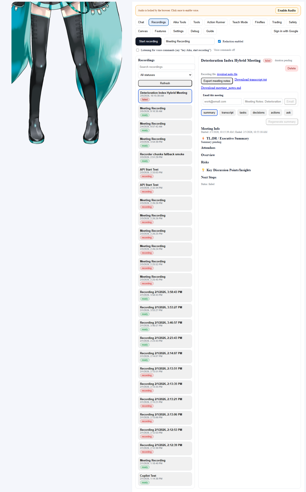

### What it is
Local meeting recording, transcription, and structured meeting notes with action extraction.

### Key functions
- `Start/Stop recording`: One-click meeting capture.
- `Pause/Resume`: Control live recording.
- `Voice commands`: Enable in Settings to say `hey Aika, start recording`.
- `Library`: Browse recordings with status and search filters.
- `Summary`: TL;DR, attendees, risks, discussion points, and next steps.
- `Transcript`: Full transcript with timestamps and speakers.
- `Tasks`: Edit task list and save back to the meeting record.
- `Decisions`: Extracted decisions list.
- `Actions`: Run follow-up actions (draft email, create doc, etc.).
- `Ask`: Ask questions about one meeting or across all meetings.
- `Export`: Download transcript and notes or email the recap.

### When to use
- Any meeting or call you want to capture and later reference.

### How to use
1. Click `Start Recording`.
2. Let the meeting run; use `Pause` and `Resume` as needed.
3. Click `Stop` to finalize and process.
4. Open the recording from the library.
5. Review `Summary`, `Tasks`, and `Decisions`.
6. Use `Actions` to create follow-ups.

## Aika Tools Tab (Aika Tools Workbench)
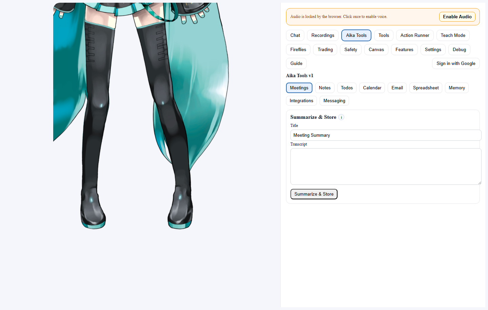

### What it is
A structured set of tools for daily operations and personal productivity.

### Tool groups and when to use them
- `Meeting Summaries`: Turn raw transcripts into structured summaries and store them.
- `Notes`: Create or search notes for long-term recall.
- `Todos`: Create and list tasks with priority and due dates.
- `Calendar`: Create calendar holds and invite attendees.
- `Email`: Draft or send emails with review gates.
- `Spreadsheet`: Apply structured updates to local files or sheets.
- `Memory`: Store or search memory tiers for personalization.
- `Integrations`: Check connection status and health.
- `Messaging`: Send notifications to Slack/Discord/Telegram.

### How to use
1. Choose a tool tab (for example `Notes`).
2. Fill in the form fields.
3. Click the action button (for example `Create Note`).
4. Review the response for success or errors.

## Tools Tab (MCP-lite Tools)

### What it is
Direct access to MCP-lite tools, approvals, and execution history.

### Key functions
- `Tool List`: Browse available tools and descriptions.
- `Call Tool`: Execute a tool by name with JSON parameters.
- `Approvals`: Approve or deny high-risk tool actions.
- `Tool History`: View recent tool calls and statuses.

### When to use
- You want full control over tool invocation.
- You need to run a tool with custom JSON parameters.

## Action Runner Tab
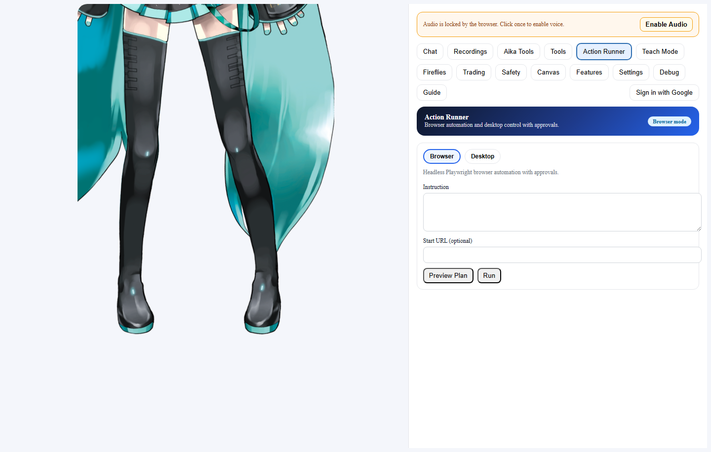

### What it is
Browser automation plus a Desktop mode for local Windows control (mouse, keyboard, screenshots).

### Key functions
- Mode switch: `Browser` or `Desktop`.
- `Preview Plan`: Generates an action plan from a prompt.
- `Run`: Executes the plan with approval gates.
- `Approvals`: Required for risky steps, new domains, and all desktop runs.
- `Artifacts`: Screenshots and extracted text saved to `data/action_runs/` or `data/desktop_runs/`.

### When to use
- Web tasks like scraping, form filling, or data extraction.
- Local tasks like opening apps, typing, or taking screenshots.
- Desktop mode requires an active Windows session (screen unlocked).

### How to use
1. Choose `Browser` or `Desktop` mode.
2. Enter an instruction (and optional start URL for Browser).
3. Click `Preview Plan` and review the JSON (or load the Desktop sample).
4. Click `Run` and approve if prompted.
5. Review the timeline and artifacts.

## Teach Mode Tab
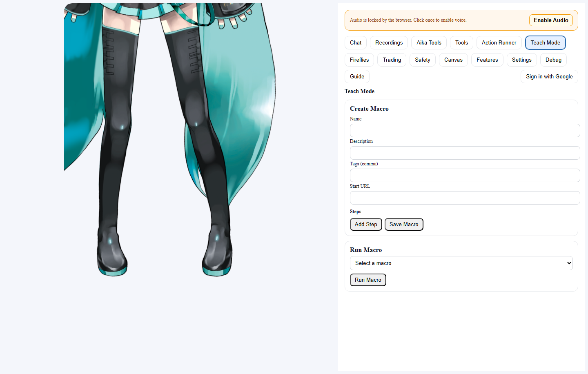

### What it is
Create reusable browser macros with parameters.

### Key functions
- Step types: `goto`, `click`, `type`, `press`, `waitFor`, `extractText`, `screenshot`.
- `Save Macro`: Stores in `data/skills/macros/`.
- `Run Macro`: Execute with optional parameters.

### When to use
- Repeatable web workflows you want to run safely on demand.

### How to use
1. Fill out macro name, description, tags, and start URL.
2. Add steps and save.
3. Select the macro and run it.

## Fireflies Tab
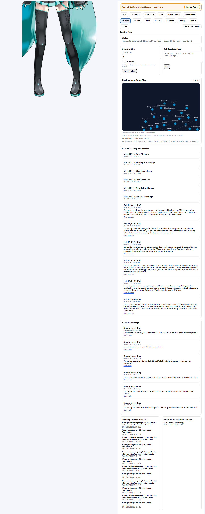

### What it is
Local Fireflies meeting sync and RAG Q&A with knowledge graph.

### Key functions
- `Sync Fireflies`: Pull transcripts into local RAG.
- `Ask`: Q&A with citations.
- `Knowledge Graph`: Visual map of participants and topics.
- `Recent Meetings`: Summaries and links to transcripts.
- `Local Recordings`: Your own recorded meetings.

### When to use
- Ask questions across past meetings.
- Surface meeting insights and decisions quickly.

## Trading Tab
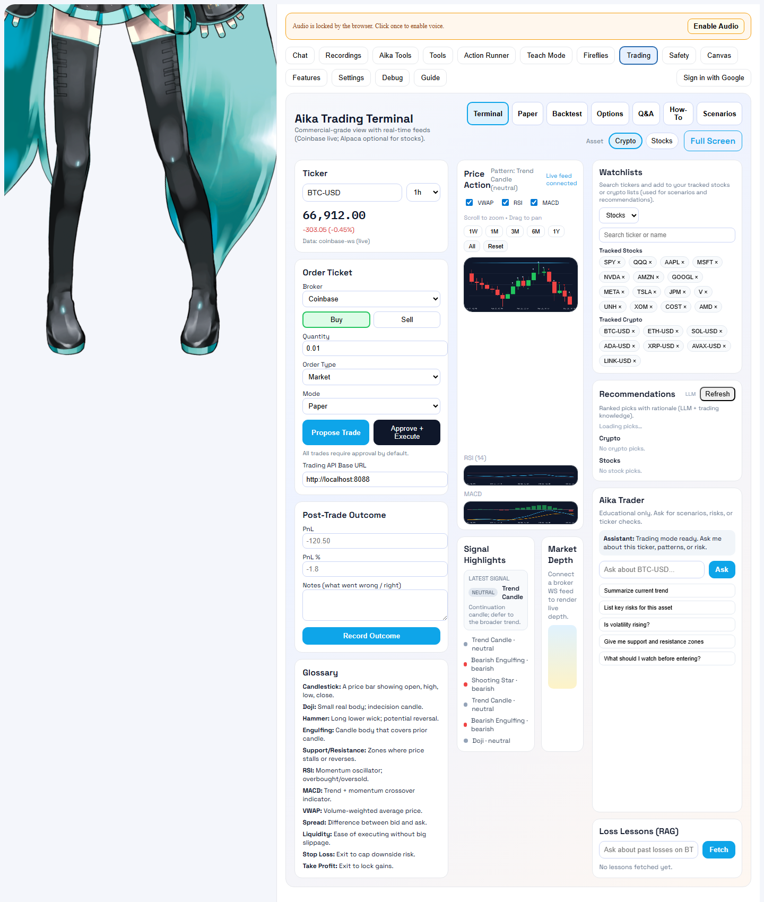

### What it is
A full trading command center, including charts, paper trading, backtests, options tools, and a knowledge RAG.

This is educational. All trading involves risk. Use paper mode until you are confident and have an approval workflow in place.

### Terminal (Live Analysis + Order Ticket)

Key functions
- `Ticker`: Symbol input with interval selector.
- `Price action`: Candlestick chart with VWAP, RSI, and MACD overlays.
- `Signals`: Pattern highlights and recent bias events.
- `Order Ticket`: Propose and approve trades (paper or live).
- `Post-Trade Outcome`: Record PnL and lessons learned.
- `Loss Lessons (RAG)`: Query past trade outcomes.
- `Watchlists`: Track stocks/crypto for scenarios and recommendations.
- `Recommendations`: Ranked picks with rationale and analysis.
- `Aika Trader`: Chat panel for trading questions.

When to use
- Fast context on a ticker before you trade.
- Structured review of chart, signal, and risk before proposing a trade.

### Paper (Synthetic Strategy Runs)
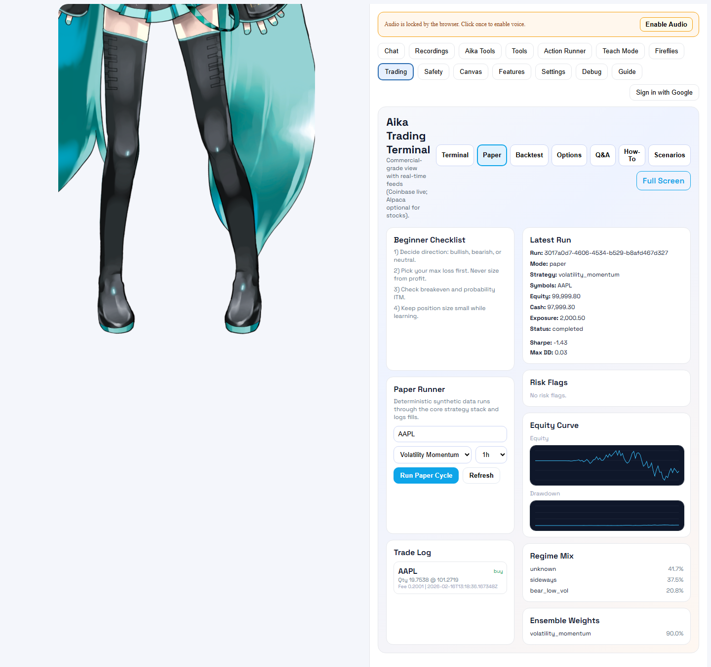

Key functions
- `Paper Runner`: Run strategies on synthetic data.
- `Trade Log`: See fills and fees.
- `Metrics`: Equity curve, drawdown, risk flags, regime mix.

When to use
- Test behavior without financial risk.

### Backtest (Strategy Evaluation)
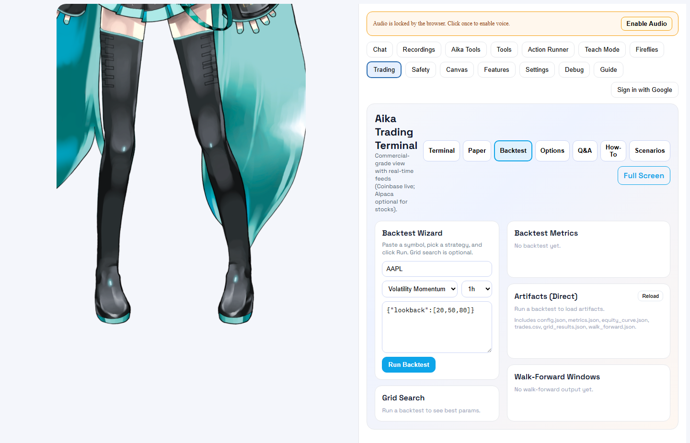

Key functions
- `Backtest Wizard`: Run strategies on historical data.
- `Grid Search`: Find best parameters.
- `Artifacts`: Export curves, trades, and metrics.
- `Walk-Forward`: Validate stability across windows.

When to use
- Validate strategy logic before paper or live trading.

### Options (Chain, Strategy, Scanner)
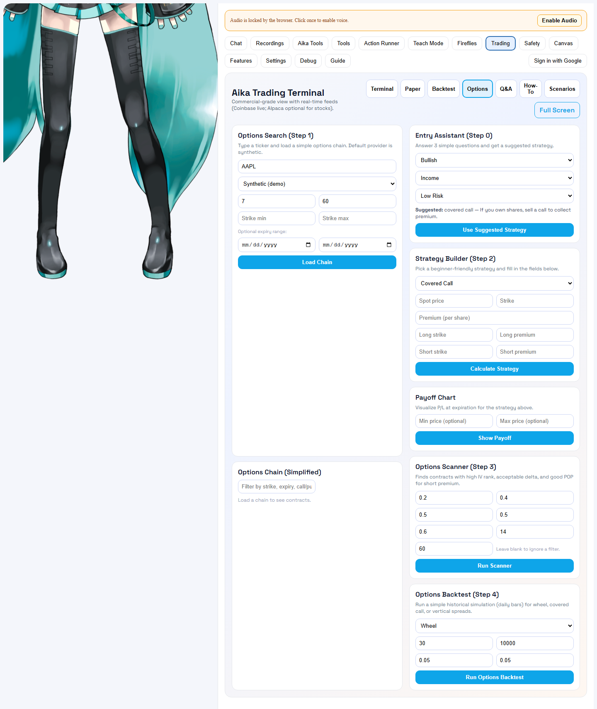

Key functions
- Step 1: Load options chain (synthetic or Polygon).
- Step 2: Strategy calculator (covered call, cash-secured put, spreads).
- Step 3: Payoff and scanner (IV rank, delta, POP filters).
- Step 4: Options backtest (wheel, covered call, verticals).

When to use
- Evaluate options trades with risk-aware filters and payoff charts.

### Q&A (Trading Knowledge)
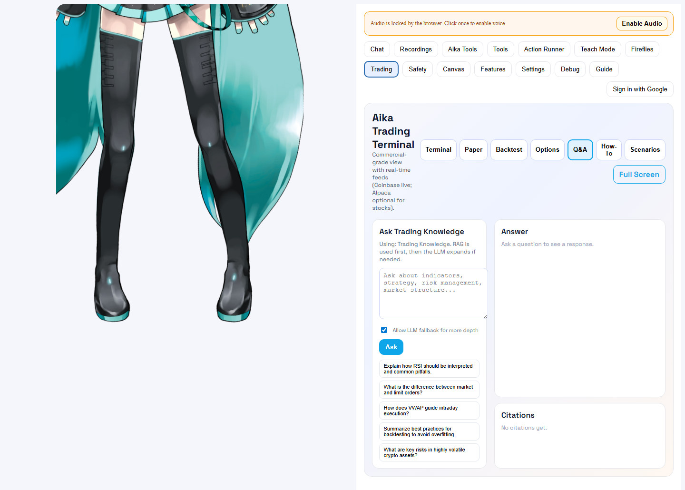

Key functions
- Ask questions across trading knowledge RAG.
- Optional LLM fallback for deeper explanations.
- Citations for traceability.

When to use
- Rapid learning about indicators, risk, and market structure.

### Knowledge (RAG + Sources)
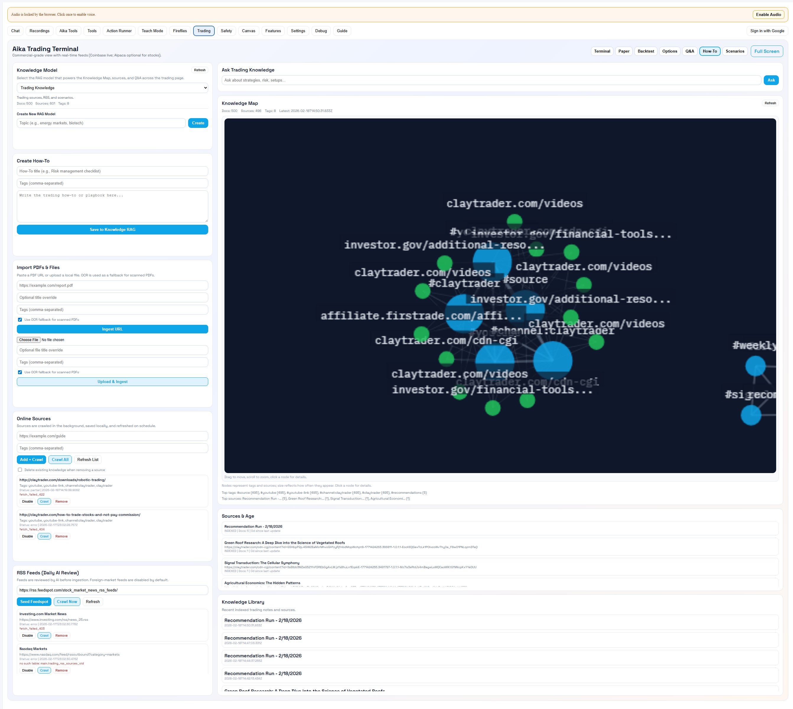

Key functions
- Choose the active RAG model.
- Create How-To entries.
- Ingest URLs and files.
- Manage sources and RSS feeds.
- Knowledge map for tags and topics.

When to use
- Build your own knowledge base and reuse it across Q&A and recommendations.

### Scenarios (Market Context Sweeps)
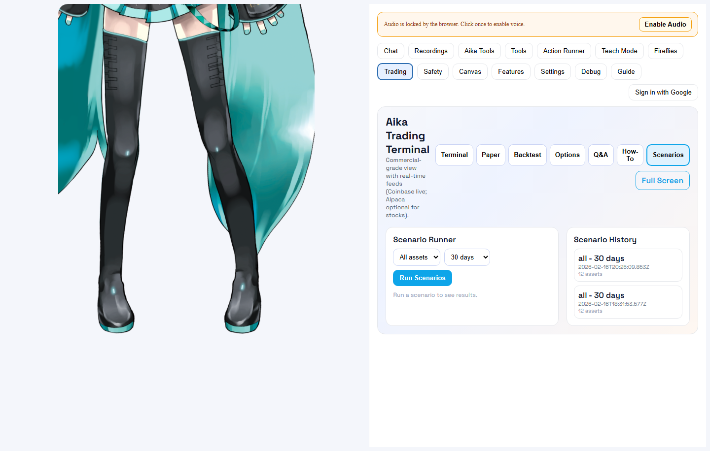

Key functions
- Run scenario scans across watchlists.
- Compare 7/30/90/180-day windows.
- Open detailed scenario metrics and narratives.

When to use
- Weekly or monthly review of your watchlists.

## Trading Scenarios (Walkthroughs)

### Scenario 1: Daily Pre-Market Routine
1. Open `Signals` (standalone page) and review top trends.
2. Open `Trading` ? `Scenarios` and run a 30-day sweep.
3. Click a candidate and view the detail metrics.
4. Open `Trading` ? `Terminal` and inspect price action and indicators.
5. If the setup still looks strong, propose a paper trade.

### Scenario 2: Options Income Workflow
1. Open `Trading` ? `Options`.
2. Load the chain for your symbol.
3. Use the strategy selector and payoff chart to compare setups.
4. Run the options scanner with conservative filters.
5. Backtest the option strategy before acting.

### Scenario 3: Post-Trade Learning Loop
1. In `Trading` ? `Terminal`, record your trade outcome.
2. Use `Loss Lessons (RAG)` to see similar outcomes.
3. Save a How-To entry in `Trading` ? `Knowledge`.
4. Ask a question in `Trading` ? `Q&A` to reinforce the lesson.

## Safety Tab
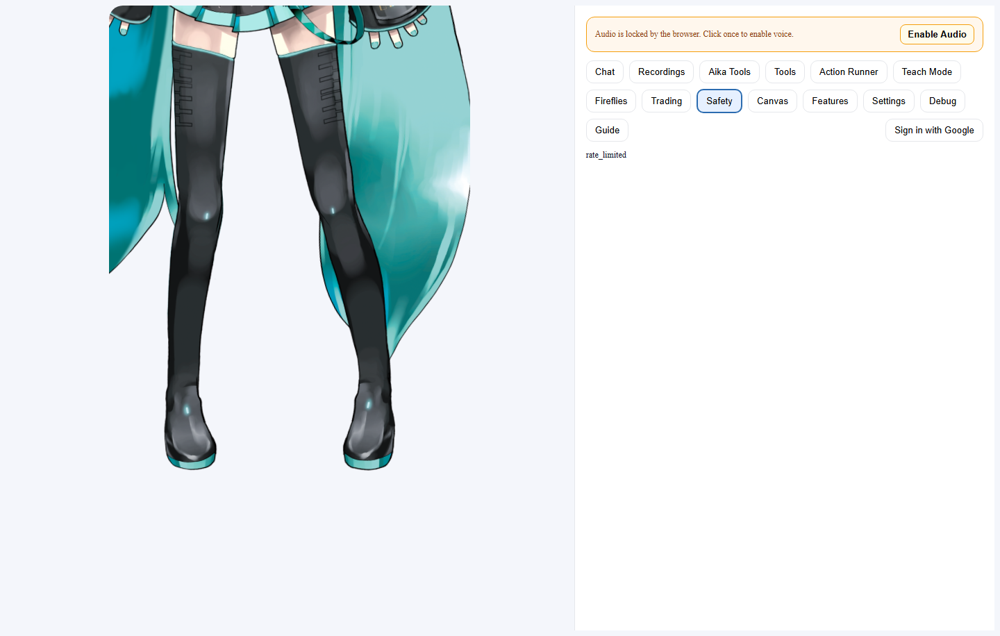

### What it is
Central guardrails for autonomy, approvals, and auditability.

### Key functions
- `Autonomy level`: Assistive, supervised, or autonomous.
- `Risk threshold`: Controls what requires approval.
- `Requires approval`: Explicit action types needing approval.
- `Protected paths`: File system protection list.
- `Network allowlist`: Allowed outbound domains.
- `Kill switch`: Pause automation instantly.
- `Approvals`: Review and approve pending actions.
- `Audit log`: Tamper-evident audit history.

### When to use
- Before enabling automation or live trading.
- During security reviews.

## Canvas Tab
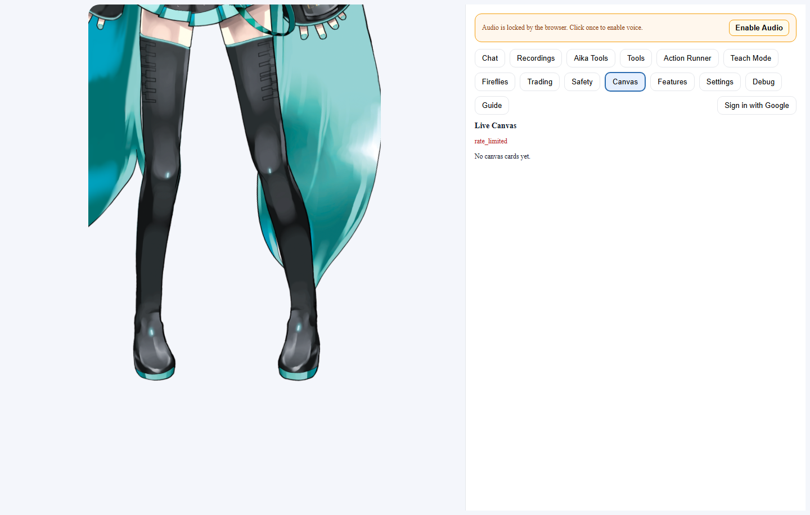

### What it is
A live board of server-pushed cards (notes, summaries, todos).

### When to use
- A quick operational dashboard of recent events and summaries.

## Features Tab
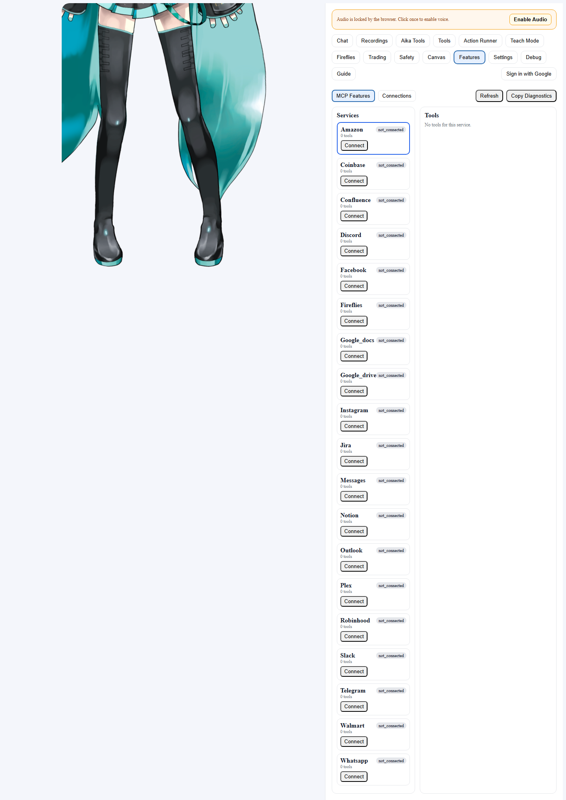

### MCP Features
- Discover MCP services and tools.
- Connect services and view status.
- Jump to tool execution in the Tools tab.

### Connections View
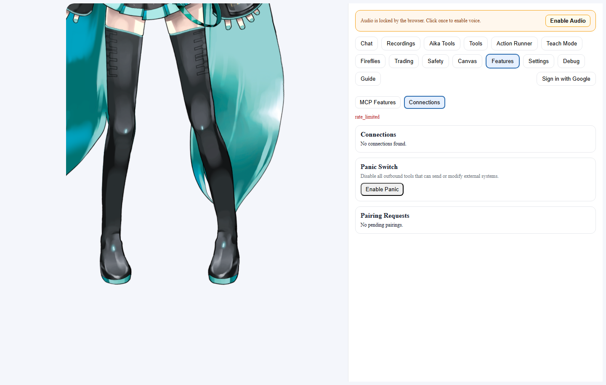

- OAuth status for services.
- Panic switch for outbound tools.
- Pairing approvals for chat channels.

## Settings Tab

### Integrations
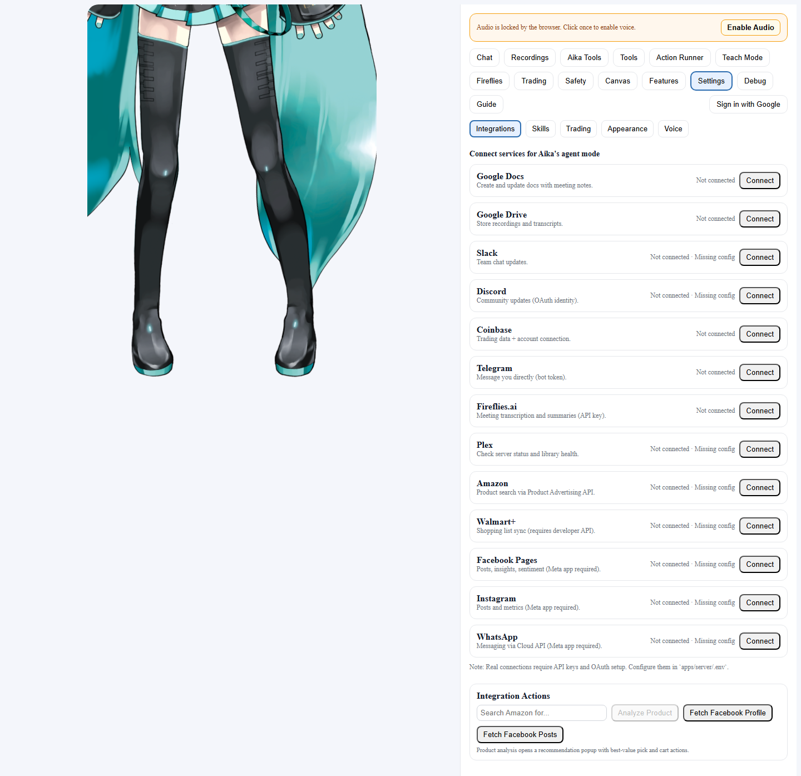

Key functions
- Connect or disconnect services.
- Amazon product analysis popup.
- Facebook profile/posts fetch.

### Skills
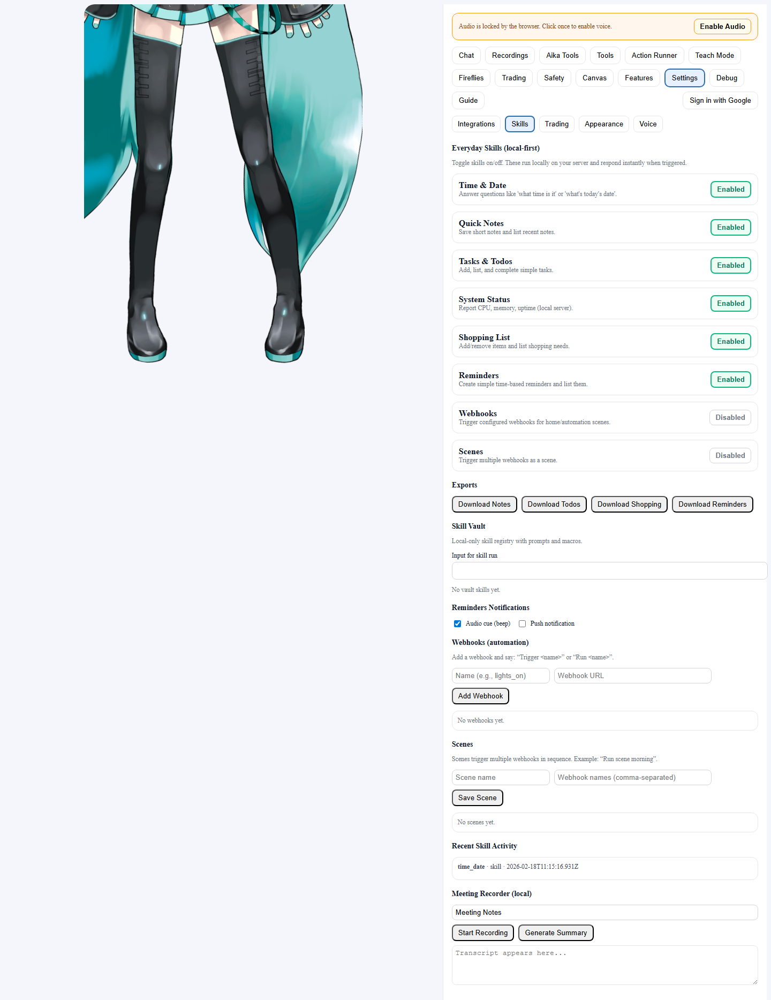

Key functions
- Toggle local skills on/off.
- Export notes, todos, shopping lists, reminders.
- Skill Vault: run local prompt skills/macros.
- Reminder notifications (audio/push).
- Webhooks and scenes for automation.
- Meeting recorder tools.

### Trading
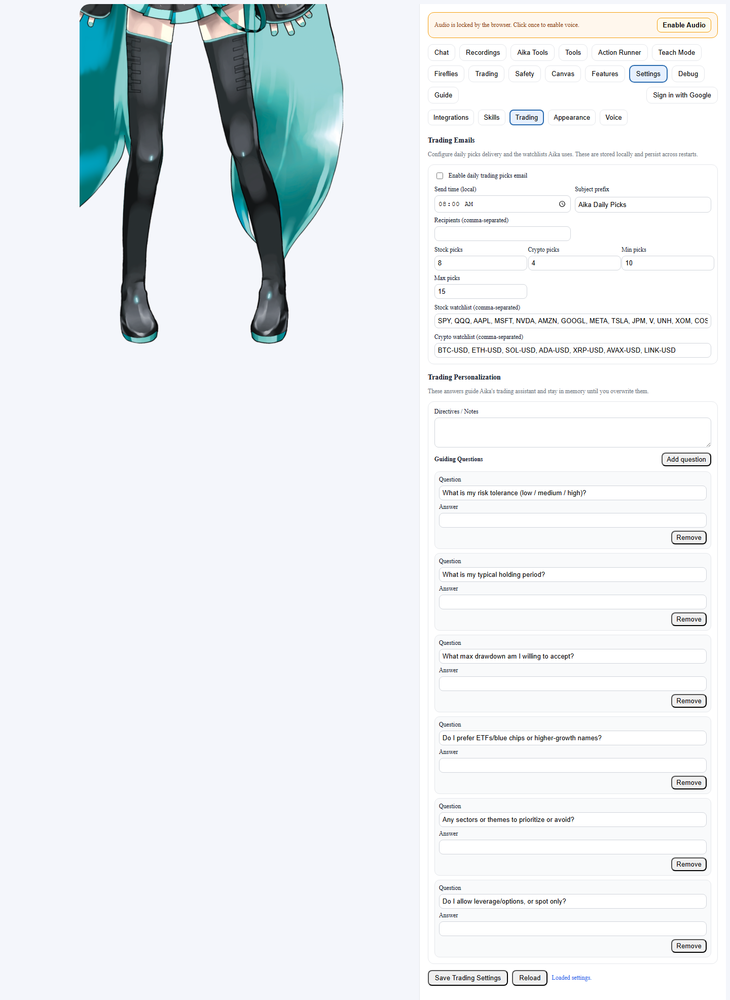

Key functions
- Daily picks email schedule and recipients.
- Watchlist preferences for email output.

### Appearance
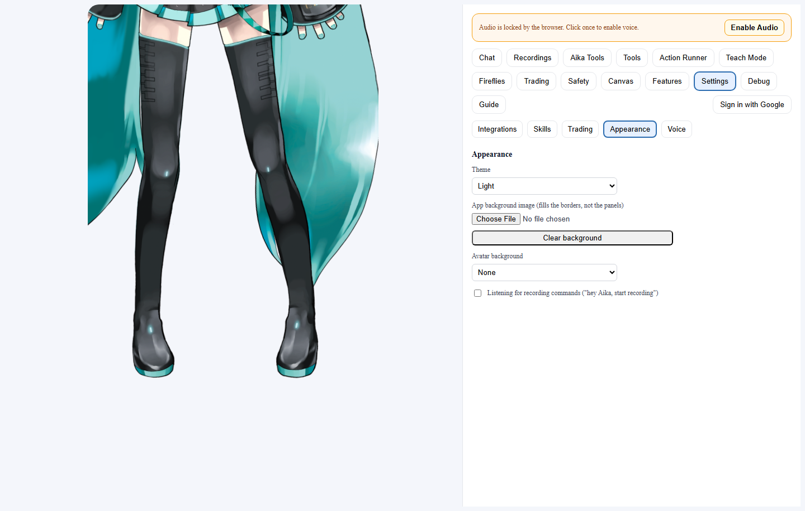

Key functions
- Theme selection.
- App background upload.
- Avatar model and background selection.
- Voice command listening toggle.

### Voice
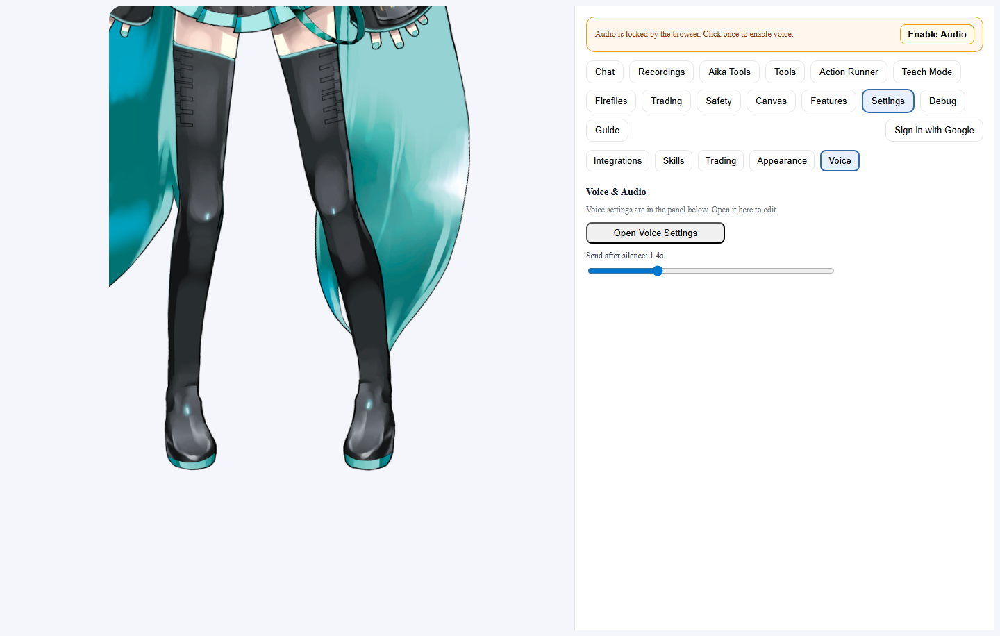

Key functions
- Open the voice settings panel.
- Adjust `Send after silence` threshold.

## Debug Tab
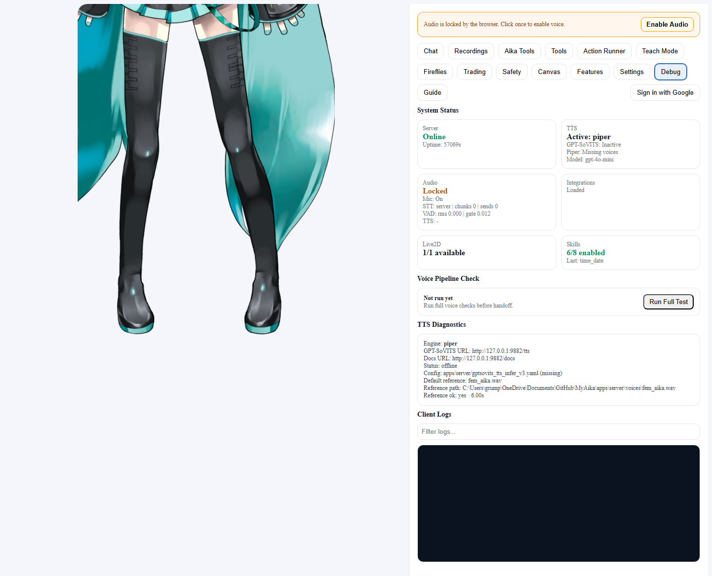

### Key functions
- Server status and uptime.
- TTS engine status and diagnostics.
- Voice pipeline full test.
- Client logs with filters.

## Guide Tab

This tab renders the full guide inside the UI and links to the Markdown file.

## Standalone Pages

### Signals Monitor

- `http://localhost:3000/signals` shows macro, energy, weather, and supply chain signals.

### Fireflies RAG

- `http://localhost:3000/fireflies-rag` lets you sync and query Fireflies directly.

### Trading Full Screen
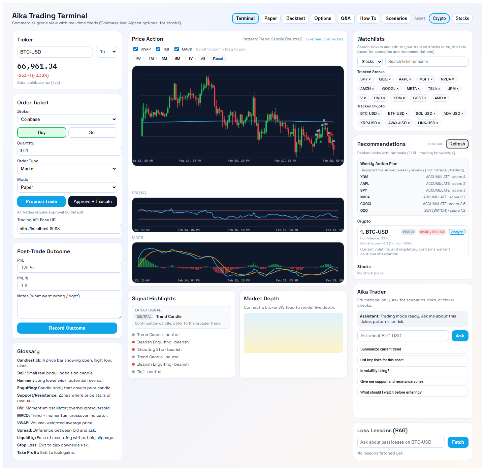

- `http://localhost:3000/trading` opens a full-screen trading terminal.

## Data Storage Map
- `data/action_runs/` : Action Runner artifacts (screenshots, HTML, run.json).
- `data/desktop_runs/` : Desktop Runner artifacts (screenshots, run.json).
- `data/skills/` : Teach Mode macros and skill vault entries.
- `apps/server/data/` : RAG databases and local storage.
- `logs/` : Server logs and activity traces.

## CLI Samples
- `npm run rag:sample` : Run a hybrid RAG query sample.
- `npm run rag:fts` : Rebuild the lexical FTS index.
- `npm run desktop:sample` : Desktop sample (set `DESKTOP_SAMPLE_RUN=1` to execute).

## Troubleshooting
- Mic not working on iOS: use HTTPS and grant permissions.
- Audio locked: click `Enable Audio` once.
- GPT-SoVITS or Piper offline: check TTS Diagnostics in Debug.
- Integrations show missing config: update `apps/server/.env` and restart the server.
- RAG lexical search not returning results: run `npm run rag:fts` to rebuild the FTS index.

## Sources (Educational References)
- https://www.sec.gov/about/reports-publications/investor-publications/day-trading-your-dollars-at-risk
- https://www.finra.org/investors/investing/investment-products/options
- https://www.sec.gov/investor/pubs/assetallocation.htm

