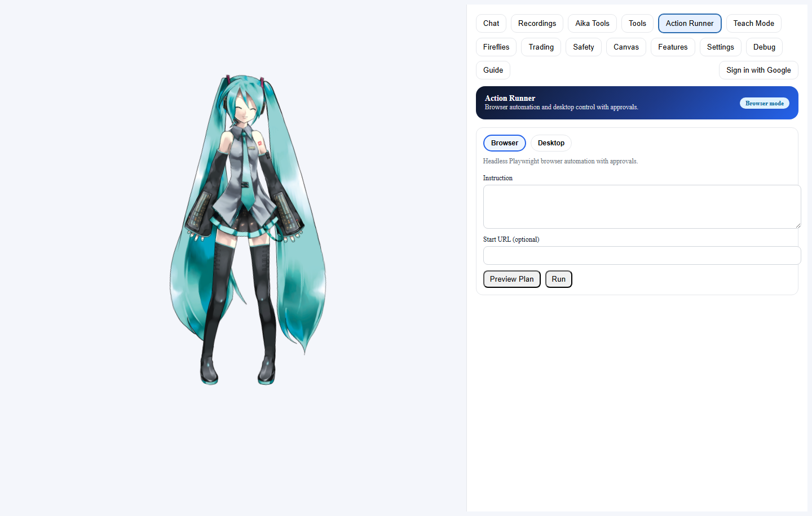

# MyAika User Guide (Training Manual)

Last updated: February 19, 2026

## Sidebar Navigation (Quick Links)
Use these links as a sidebar jump list inside the guide.

### Core
- [Purpose](#purpose)
- [Quickstart](#quickstart)
- [Navigation Map (Top Tabs)](#navigation-map-top-tabs)
- [Global Concepts](#global-concepts)
- [Chat Tab](#chat-tab)
- [Recordings Tab (Meeting Copilot)](#recordings-tab-meeting-copilot)
- [Aika Tools Tab (Aika Tools Workbench)](#aika-tools-tab-aika-tools-workbench)
- [Tools Tab (MCP-lite Tools)](#tools-tab-mcp-lite-tools)
- [Action Runner Tab](#action-runner-tab)
- [Teach Mode Tab](#teach-mode-tab)
- [Agent Platform (Multi-Agent + Routing)](#agent-platform-multi-agent--routing)
- [Memory Lifecycle + Knowledge Graph](#memory-lifecycle--knowledge-graph)
- [Worker Queue + Plugins](#worker-queue--plugins)
- [Fireflies Tab](#fireflies-tab)
- [RAG Eval Harness](#rag-eval-harness)
- [Trading Tab](#trading-tab)
- [Safety Tab](#safety-tab)
- [Canvas Tab](#canvas-tab)
- [Features Tab](#features-tab)
- [Settings Tab](#settings-tab)
- [Debug Tab](#debug-tab)
- [Guide Tab](#guide-tab)
- [Standalone Pages](#standalone-pages)
- [Data Storage Map](#data-storage-map)
- [CLI Samples](#cli-samples)
- [Troubleshooting](#troubleshooting)
- [Sources (Educational References)](#sources-educational-references)

### Trading Subtabs
- [Terminal (Live Analysis + Order Ticket)](#terminal-live-analysis--order-ticket)
- [Paper (Synthetic Strategy Runs)](#paper-synthetic-strategy-runs)
- [Backtest (Strategy Evaluation)](#backtest-strategy-evaluation)
- [Options (Chain, Strategy, Scanner)](#options-chain-strategy-scanner)
- [Q&A (Trading Knowledge)](#qa-trading-knowledge)
- [Knowledge (RAG + Sources)](#knowledge-rag--sources)
- [Scenarios (Market Context Sweeps)](#scenarios-market-context-sweeps)
- [Trading Scenarios (Walkthroughs)](#trading-scenarios-walkthroughs)

### Standalone Pages
- [Signals Monitor](#signals-monitor)
- [Fireflies RAG](#fireflies-rag)
- [Trading Full Screen](#trading-full-screen)

## Purpose
This guide is a complete, tab-by-tab walkthrough of MyAika. It explains what each feature does, why you would use it, and how to use it safely and effectively. It also includes step-by-step scenarios for the trading stack.

This is an educational guide and not financial advice. Always use paper mode first and never trade money you cannot afford to lose.

## Quickstart
1. Install dependencies: `npm install`
2. Start the server: `npm run dev:server`
3. Start the web UI: `npm run dev:web`
4. Open the UI: `http://localhost:3000`

If you are on iPad/Safari, microphone access requires HTTPS. Use `npm run dev:ipad` or `npm run dev:web:https`.

## Navigation Map (Top Tabs)
- `Chat`: Conversational UI, voice control, and general assistant use.
- `Recordings`: Meeting Copilot for recording, transcription, and meeting notes.
- `Aika Tools`: Structured tools for notes, todos, calendar, email, memory, and messaging.
- `Tools`: MCP-lite tool browser, direct tool execution, approvals, and history.
- `Action Runner`: Browser automation plus Desktop mode (local control) with approvals and artifacts.
- `Teach Mode`: Record and run reusable browser macros.
- `Fireflies`: Fireflies meeting sync, RAG Q&A, and knowledge graph.
- `Trading`: Full trading terminal with paper, backtest, options, knowledge RAG, and scenarios.
- `Safety`: Autonomy controls, approval rules, kill switch, and audit log.
- `Canvas`: Live cards that Aika updates from server events.
- `Features`: MCP discovery and Connections portal.
- `Settings`: Integrations, Skills, Trading preferences, Appearance, and Voice controls.
- `Debug`: System health, voice pipeline checks, and logs.
- `Guide`: This user guide in-app.

## Global Concepts
- Local-first: Most state (memory, recordings, RAG, audit logs) stays in `data/` locally.
- Safety-first: Risky actions are deny-by-default and require approvals.
- RAG: Retrieval-augmented generation is used for Fireflies and Trading knowledge.
- Hybrid RAG: Semantic embeddings + lexical FTS to improve recall.
- Approvals: High-risk actions route through approvals before execution.

## Chat Tab

### What it is
The main conversational workspace for text and voice interactions with Aika.

### Key functions
- `Text chat`: Type a prompt and press Enter or click `Send`.
- `Voice chat`: Click `Mic On` or press `Space` to start listening.
- `Voice status`: Mic indicator shows `Mic active`, `Mic idle`, or `Mic off`.
- `Feedback`: Give `Thumbs Up` or `Thumbs Down` on assistant responses.
- `Citations`: If a response uses stored meeting memory, citations appear per message.
- `Settings` (panel button): Opens voice and avatar controls, including advanced voice tuning.

### When to use
- Brainstorming, general assistance, and conversational tasks.
- Hands-free use with voice input and TTS output.

### How to use
1. Click `Mic On` or type a prompt.
2. Ask Aika a clear task: `Summarize my last meeting`.
3. If you are using voice, wait for the `Mic active` indicator.
4. Review the response and use `Thumbs Up/Down` for feedback.

### Common tips
- If audio is locked, click `Enable Audio` once.
- If mic access fails, try Chrome/Edge or HTTPS on iOS.

## Recordings Tab (Meeting Copilot)

### What it is
Local meeting recording, transcription, and structured meeting notes with action extraction.

### Key functions
- `Start/Stop recording`: One-click meeting capture.
- `Pause/Resume`: Control live recording.
- `Voice commands`: Enable in Settings to say `hey Aika, start recording`.
- `Library`: Browse recordings with status and search filters.
- `Summary`: TL;DR, attendees, risks, discussion points, and next steps.
- `Transcript`: Full transcript with timestamps and speakers.
- `Tasks`: Edit task list and save back to the meeting record.
- `Decisions`: Extracted decisions list.
- `Actions`: Run follow-up actions (draft email, create doc, etc.).
- `Ask`: Ask questions about one meeting or across all meetings.
- `Export`: Download transcript and notes or email the recap.

### When to use
- Any meeting or call you want to capture and later reference.

### How to use
1. Click `Start Recording`.
2. Let the meeting run; use `Pause` and `Resume` as needed.
3. Click `Stop` to finalize and process.
4. Open the recording from the library.
5. Review `Summary`, `Tasks`, and `Decisions`.
6. Use `Actions` to create follow-ups.

## Aika Tools Tab (Aika Tools Workbench)

### What it is
A structured set of tools for daily operations and personal productivity.

### Tool groups and when to use them
- `Meeting Summaries`: Turn raw transcripts into structured summaries and store them.
- `Notes`: Create or search notes for long-term recall.
- `Todos`: Create and list tasks with priority, due dates, and reminder timestamps.
- `Calendar`: Create calendar holds and invite attendees.
- `Email`: Inbox preview, action layer (todo + follow-up), rules automation, and approval-gated send flows.
- `Spreadsheet`: Apply structured updates to local files or sheets.
- `Memory`: Store or search memory tiers for personalization.
- `Integrations`: Check connection status and health.
- `Messaging`: Send notifications to Slack/Discord/Telegram.

### How to use
1. Choose a tool tab (for example `Notes`).
2. Fill in the form fields.
3. Click the action button (for example `Create Note`).
4. Review the response for success or errors.

### Email Workflows (Inbox + Context)

What it is
- Pull recent Gmail/Outlook previews without mirroring full mailboxes locally.
- Add RAG context from notes + todos to help craft replies quickly.

Key functions
- `Refresh Inbox`: Pulls recent email previews for the selected provider and lookback window.
- `Sync Gmail + Outlook`: Runs connector sync to ingest and index recent threads.
- `Message Context`: Shows sender, recipients, timestamp, and snippet.
- `Find Context`: Queries your RAG store for related notes/todos.
- `Use in Draft`: Prefills the draft fields with the selected message.

How to use
1. Connect Gmail and/or Microsoft in the Integrations panel.
2. Set provider + lookback days, then click `Refresh Inbox`.
3. Select a message to view details and click `Find Context`.
4. Click `Use in Draft` to seed the reply composer.

### Email Action Layer (Todos + Follow-ups)

What it is
- Convert an email into a structured todo.
- Schedule follow-ups with optional calendar holds.
- Generate reply drafts with RAG context and approval gates.

Key functions
- `Convert to Todo`: Creates a todo with title, due date, tags, list, and notes.
- `Schedule Follow-up`: Sets `followUpAt` plus optional `reminderAt`.
- `Create calendar hold`: Reserves time for the follow-up.
- `Reply With Context`: Drafts a reply using RAG context.
- `Send With Context`: Sends only after approval gates.

How to use
1. Select an email in Inbox Preview.
2. Fill out the Action Layer fields and click `Create Todo` or `Schedule Follow-up`.
3. Use `Reply With Context` to generate a draft.
4. Use `Send With Context` only after reviewing the draft and approving the action.

### Rules & Automation (Auto Follow-ups)

What it is
- Auto-create follow-up todos from specific senders, labels, or folders.
- Deduplicate and throttle so you do not create duplicate follow-ups.

Key functions
- `Enable rules`: Turns automation on/off without editing env vars.
- `Interval minutes`: How often the rule engine runs automatically.
- `Run on startup`: Executes rules once when the server boots.
- `Preview Rules`: Shows which emails would create follow-ups without writing todos.
- `Gmail Rules`: Match by sender or label IDs.
- `Outlook Rules`: Match by sender or folder IDs.
- `Dedup hours`: Prevents repeated follow-ups for the same message.
- `Priority + Tags`: Applies consistent metadata to created follow-ups.

How to use
1. Open `Rules & Automation`.
2. Add senders and label/folder IDs.
3. Choose follow-up timing, priority, tags, and list ID.
4. Click `Save Rules`, then `Preview Rules` to validate matches.
5. Click `Run Rules Now` when you are ready to create follow-ups.

### Reminder Delivery (Slack/Telegram/Email/In-app)

What it is
- Route todo reminders to your preferred channels with approval gates.
- Store reminder targets in the app instead of `.env`.

Key functions
- `Enable reminder delivery`: Toggle reminders globally.
- `Channels`: Choose `In-app`, `Slack`, `Telegram`, and/or `Email`.
- `Targets`: Set Slack channels, Telegram chat IDs, and email recipients.
- `Interval minutes`: Control how often the reminder loop runs.
- `Run on startup`: Fire reminders immediately on server boot.

How to use
1. Turn on reminder delivery and pick your channels.
2. Add channel targets and click `Save Reminder Settings`.
3. Click `Run Reminders Now` for a manual test run.
4. Set `reminderAt` on todos to trigger delivery.

Notes
- Email reminders require Gmail send scopes; missing scopes will queue into outbox if `EMAIL_OUTBOX_FALLBACK=1`.
- External channels (Slack/Telegram/Email) run through approval gates for safety.

## Tools Tab (MCP-lite Tools)

### What it is
Direct access to MCP-lite tools, approvals, and execution history.

### Key functions
- `Tool List`: Browse available tools and descriptions.
- `Call Tool`: Execute a tool by name with JSON parameters.
- `Approvals`: Approve or deny high-risk tool actions.
- `Tool History`: View recent tool calls and statuses.

### When to use
- You want full control over tool invocation.
- You need to run a tool with custom JSON parameters.

### How to use
1. Open the `Tools` tab and scan the tool list.
2. Click a tool name to view its schema and description.
3. Fill in the JSON payload and click `Run`.
4. If an approval is required, approve it in the Approvals panel.
5. Review the tool output and copy any artifacts or IDs you need.

## Action Runner Tab

### What it is
Browser automation plus a Desktop mode for local Windows control (mouse, keyboard, screenshots).

### Key functions
- Mode switch: `Browser` or `Desktop`.
- `Preview Plan`: Generates an action plan from a prompt.
- `Run`: Executes the plan with approval gates.
- `Approvals`: Required for risky steps, new domains, and all desktop runs.
- `Approval mode` (Desktop): Per-run or per-step approvals.
- `Panic Stop` (Desktop): Stop a running automation immediately.
- `Artifacts`: Screenshots and extracted text saved to `data/action_runs/` or `data/desktop_runs/`.
- `Vision OCR` (Desktop): Capture screen text into OCR artifacts.
- `UI Automation` (Desktop): Target controls via `uiaClick` and `uiaSetValue`.
- `Macro Recorder` (Desktop): Capture live mouse/keyboard into a reusable macro.
- `Saved Macros` (Desktop): Load, run, or delete recorded macros.

### When to use
- Web tasks like scraping, form filling, or data extraction.
- Local tasks like opening apps, typing, or taking screenshots.
- Desktop mode requires an active Windows session (screen unlocked).
- Record repeatable desktop flows and replay them on demand.

### How to use
1. Choose `Browser` or `Desktop` mode.
2. Enter an instruction (and optional start URL for Browser).
3. Click `Preview Plan` and review the JSON (or load the Desktop sample).
4. Click `Run` and approve if prompted.
5. Review the timeline and artifacts.
6. Desktop sample: click `Load Sample` to run the Notepad demo (approval required).
7. Desktop macro recorder: enter a name, click `Start Recording`, perform the steps, then press `F8` to stop.
8. Click `Save Macro` and use the Saved Macros list to `Load` or `Run` it later.
9. For per-step approvals, set `Approval mode` to `Per step` and approve each risky action.
10. Use `Panic Stop` if the desktop run must halt immediately.

## Teach Mode Tab

### What it is
Create reusable browser or desktop macros with parameters.

### Key functions
- Mode selector: `Browser` or `Desktop`.
- Browser steps: `goto`, `click`, `type`, `press`, `waitFor`, `extractText`, `screenshot`.
- Desktop steps: `launch`, `wait`, `type`, `key`, `mouseMove`, `mouseClick`, `clipboardSet`, `screenshot`, `visionOcr`, `uiaClick`, `uiaSetValue`.
- `Save Macro`: Stores in `data/skills/macros/`.
- `Run Macro`: Execute with optional parameters.

### When to use
- Repeatable web workflows you want to run safely on demand.

### How to use
1. Choose `Browser` or `Desktop` mode.
2. Fill out macro name, description, tags (and start URL for browser).
3. Add steps and save.
4. Select the macro and run it.

## Agent Platform (Multi-Agent + Routing)
### What it is
An agent architecture that uses a planner, executor, and critic to produce safer plans and route model calls between local and cloud providers.

### Key functions
- Multi-pass planning and critique when `AGENT_MULTI_PASS=1`.
- Dynamic model routing with `MODEL_ROUTER_MODE` (`auto`, `local`, `cloud`).
- Local LLM support via `LOCAL_LLM_BASE_URL` + `LOCAL_LLM_MODEL`.

### How to use
1. Set `AGENT_MULTI_PASS=1` in `apps/server/.env`.
2. Optionally set `LOCAL_LLM_BASE_URL` and `LOCAL_LLM_MODEL` to use a local model.
3. Restart the server.
4. Use Action Runner or Teach Mode and review the plan explanation.

## Memory Lifecycle + Knowledge Graph
### What it is
Retention policies for long-term memory tiers plus a knowledge graph generated from memory entities.

### Key functions
- Retention windows per tier: `MEMORY_RETENTION_DAYS_TIER1/2/3`.
- Admin trigger: `POST /api/memory/retention/run` (supports `dryRun`).
- Graph endpoint: `GET /api/knowledge-graph` (nodes + edges).

### How to use
1. Set retention day values in `apps/server/.env`.
2. Run a dry-run: `POST /api/memory/retention/run` with `{ "dryRun": true }`.
3. Fetch the graph from `GET /api/knowledge-graph` and visualize in your UI.

## Worker Queue + Plugins
### What it is
A lightweight queue for distributed ingestion/execution and a plugin registry for marketplace-style skills.

### Key functions
- Enqueue work with `POST /api/workers/enqueue`.
- External workers claim via `POST /api/workers/claim` and complete via `POST /api/workers/:id/complete`.
- Plugin manifests stored in `data/plugins/` and listed with `GET /api/plugins`.

### How to use
1. Set `WORKER_EXECUTION_MODE=inline` for local execution or `distributed` for external workers.
2. Enqueue a job such as `{ "type": "ingest.fireflies.sync", "payload": { "limit": 10 } }`.
3. Register a plugin manifest via `POST /api/plugins` (admin token required).

## Fireflies Tab

### What it is
Local Fireflies meeting sync and RAG Q&A with knowledge graph.

### Key functions
- `Sync Fireflies`: Pull transcripts into local RAG.
- `Ask`: Q&A with citations.
- `Knowledge Graph`: Visual map of participants and topics.
- `Recent Meetings`: Summaries and links to transcripts.
- `Local Recordings`: Your own recorded meetings.

### When to use
- Ask questions across past meetings.
- Surface meeting insights and decisions quickly.

### How to use
1. Click `Sync Fireflies` to pull transcripts.
2. Use `Ask` to query across meetings.
3. Open `Knowledge Graph` for participant/topic relationships.
4. Review `Recent Meetings` for summaries and follow-ups.

## RAG Eval Harness
### What it is
A regression harness to measure RAG retrieval quality with golden queries and thresholds.

### How to use
1. Edit `apps/server/evals/rag_golden.json` with golden queries.
2. Add expected `chunkIds` or `terms` for each query you care about.
3. Run `npm run rag:eval` to produce a report.
4. Run `npm run rag:eval -- --strict` to fail if required thresholds regress.
5. Commit updated golden data whenever your source data changes.

## Trading Tab

### What it is
A full trading command center, including charts, paper trading, backtests, options tools, and a knowledge RAG.

This is educational. All trading involves risk. Use paper mode until you are confident and have an approval workflow in place.

### Terminal (Live Analysis + Order Ticket)

Key functions
- `Ticker`: Symbol input with interval selector.
- `Price action`: Candlestick chart with VWAP, RSI, and MACD overlays.
- `Signals`: Pattern highlights and recent bias events.
- `Order Ticket`: Propose and approve trades (paper or live).
- `Post-Trade Outcome`: Record PnL and lessons learned.
- `Manual Trade Tracker`: Log manual trades with entry/exit and PnL tracking.
- `Loss Lessons (RAG)`: Query past trade outcomes.
- `Watchlists`: Track stocks/crypto for scenarios and recommendations.
- `Recommendations`: Ranked picks with rationale and analysis.
- `Aika Trader`: Chat panel for trading questions.

When to use
- Fast context on a ticker before you trade.
- Structured review of chart, signal, and risk before proposing a trade.
- Tracking manual trades and outcomes in one place.

How to use
1. Enter a symbol and choose an interval.
2. Review chart overlays and signals.
3. Use `Order Ticket` to propose a trade.
4. Approve the trade if required.
5. Record outcomes and lessons learned.
6. Log manual trades in `Manual Trade Tracker` to track PnL and win rate.

Tip
- Intraday stock candles require Alpaca data keys. Without them, the terminal falls back to daily bars.

### Paper (Synthetic Strategy Runs)

Key functions
- `Paper Runner`: Run strategies on synthetic data.
- `Trade Log`: See fills and fees.
- `Metrics`: Equity curve, drawdown, risk flags, regime mix.

When to use
- Test behavior without financial risk.

How to use
1. Pick a synthetic strategy or preset.
2. Run the paper simulation.
3. Review fills, fees, and metrics.
4. Iterate on parameters until results stabilize.

### Backtest (Strategy Evaluation)

Key functions
- `Backtest Wizard`: Run strategies on historical data.
- `Grid Search`: Find best parameters.
- `Artifacts`: Export curves, trades, and metrics.
- `Walk-Forward`: Validate stability across windows.

When to use
- Validate strategy logic before paper or live trading.

How to use
1. Open the Backtest Wizard.
2. Select the ticker, timeframe, and strategy.
3. Run the backtest and inspect the equity curve.
4. Export artifacts and compare parameter sets.

### Options (Chain, Strategy, Scanner)

Key functions
- Step 1: Load options chain (synthetic or Polygon).
- Step 2: Strategy calculator (covered call, cash-secured put, spreads).
- Step 3: Payoff and scanner (IV rank, delta, POP filters).
- Step 4: Options backtest (wheel, covered call, verticals).

When to use
- Evaluate options trades with risk-aware filters and payoff charts.

How to use
1. Load the options chain for your symbol.
2. Choose a strategy template.
3. Compare payoffs and adjust strikes.
4. Run the options scanner for filtered setups.

### Q&A (Trading Knowledge)

Key functions
- Ask questions across trading knowledge RAG.
- Optional LLM fallback for deeper explanations.
- Citations for traceability.

When to use
- Rapid learning about indicators, risk, and market structure.

How to use
1. Ask a question in the Q&A box.
2. Review citations and follow-up suggestions.
3. Use the answer to refine your trading thesis.

### Knowledge (RAG + Sources)

Key functions
- Choose the active RAG model.
- Create How-To entries.
- Ingest URLs and files.
- Manage sources and RSS feeds.
- Knowledge map for tags and topics.

When to use
- Build your own knowledge base and reuse it across Q&A and recommendations.

How to use
1. Pick the active RAG model.
2. Add new sources or RSS feeds.
3. Ingest URLs or files.
4. Query the knowledge base in Q&A.

### Scenarios (Market Context Sweeps)

Key functions
- Run scenario scans across watchlists.
- Compare 7/30/90/180-day windows.
- Open detailed scenario metrics and narratives.

When to use
- Weekly or monthly review of your watchlists.

How to use
1. Select a watchlist and time window.
2. Run the scenario scan.
3. Open a candidate to review detailed metrics.

## Trading Scenarios (Walkthroughs)

### Scenario 1: Daily Pre-Market Routine
1. Open `Signals` (standalone page) and review top trends.
2. Open `Trading` ? `Scenarios` and run a 30-day sweep.
3. Click a candidate and view the detail metrics.
4. Open `Trading` ? `Terminal` and inspect price action and indicators.
5. If the setup still looks strong, propose a paper trade.

### Scenario 2: Options Income Workflow
1. Open `Trading` ? `Options`.
2. Load the chain for your symbol.
3. Use the strategy selector and payoff chart to compare setups.
4. Run the options scanner with conservative filters.
5. Backtest the option strategy before acting.

### Scenario 3: Post-Trade Learning Loop
1. In `Trading` ? `Terminal`, record your trade outcome.
2. Use `Loss Lessons (RAG)` to see similar outcomes.
3. Save a How-To entry in `Trading` ? `Knowledge`.
4. Ask a question in `Trading` ? `Q&A` to reinforce the lesson.

## Safety Tab

### What it is
Central guardrails for autonomy, approvals, and auditability.

### Key functions
- `Autonomy level`: Assistive, supervised, or autonomous.
- `Risk threshold`: Controls what requires approval.
- `Requires approval`: Explicit action types needing approval.
- `Protected paths`: File system protection list.
- `Network allowlist`: Allowed outbound domains.
- `Kill switch`: Pause automation instantly.
- `Approvals`: Review and approve pending actions.
- `Audit log`: Tamper-evident audit history.
- `Admin token`: Required for approvals unless you are on localhost with no token set.

### When to use
- Before enabling automation or live trading.
- During security reviews.

### How to use
1. Set autonomy level and risk threshold.
2. Review the `Requires approval` list.
3. Enable or disable the kill switch as needed.
4. Approve or deny pending actions.

## Canvas Tab

### What it is
A live board of server-pushed cards (notes, summaries, todos).

### When to use
- A quick operational dashboard of recent events and summaries.

### How to use
1. Open `Canvas`.
2. Watch for incoming cards from running automations.
3. Click a card to jump to its source.

## Features Tab

### MCP Features
- Discover MCP services and tools.
- Connect services and view status.
- Jump to tool execution in the Tools tab.

### Connections View

- OAuth status for services.
- Panic switch for outbound tools.
- Pairing approvals for chat channels.

### How to use
1. Open `Features`.
2. Switch between MCP and Connections views.
3. Connect or disconnect providers as needed.

## Settings Tab

### Integrations

Key functions
- Connect or disconnect services.
- Amazon product analysis popup.
- Facebook profile/posts fetch.

How to use
1. Open `Settings → Integrations`.
2. Click `Connect` and complete OAuth.
3. Verify the status badge turns green.

### Skills

Key functions
- Toggle local skills on/off.
- Export notes, todos, shopping lists, reminders.
- Skill Vault: run local prompt skills/macros.
- Reminder notifications (audio/push).
- Webhooks and scenes for automation.
- Meeting recorder tools.

How to use
1. Enable the skills you want.
2. Use the export buttons to generate outputs.
3. Configure webhooks or scenes if needed.

### Trading

Key functions
- Daily picks email schedule and recipients.
- Watchlist preferences for email output.

How to use
1. Configure email recipients and schedule.
2. Save the settings.

### Appearance

Key functions
- Theme selection.
- App background upload.
- Avatar model and background selection.
- Voice command listening toggle.

How to use
1. Pick a theme and upload a background if desired.
2. Select the avatar and background model.

### Voice

Key functions
- Open the voice settings panel.
- Adjust `Send after silence` threshold.

How to use
1. Toggle voice controls on.
2. Adjust thresholds and test the mic.

## Debug Tab

### Key functions
- Server status and uptime.
- TTS engine status and diagnostics.
- Voice pipeline full test.
- Client logs with filters.

### How to use
1. Check the status cards for errors.
2. Run the full voice test.
3. Use logs for troubleshooting.

## Guide Tab

This tab renders the full guide inside the UI and links to the Markdown file.

### How to use
1. Open `Guide`.
2. Use the sidebar links at the top of this document to navigate.

## Standalone Pages

### Signals Monitor

- `http://localhost:3000/signals` shows macro, energy, weather, and supply chain signals.

How to use
1. Open the URL.
2. Review the live signal cards and trend list.

### Fireflies RAG

- `http://localhost:3000/fireflies-rag` lets you sync and query Fireflies directly.

How to use
1. Open the URL.
2. Sync Fireflies and ask questions.

### Trading Full Screen

- `http://localhost:3000/trading` opens a full-screen trading terminal.

How to use
1. Open the URL.
2. Use the terminal as in the Trading tab.

## Data Storage Map
- `data/action_runs/` : Action Runner artifacts (screenshots, HTML, run.json).
- `data/desktop_runs/` : Desktop Runner artifacts (screenshots, run.json).
- `data/desktop_macros/` : Recorded desktop macros.
- `data/skills/` : Teach Mode macros and skill vault entries.
- `data/workers/` : Worker queue state for distributed jobs.
- `data/plugins/` : Plugin manifests for marketplace-style skills.
- `apps/server/data/` : RAG databases and local storage.
- `apps/server/evals/` : RAG golden queries and evaluation fixtures.
- `logs/` : Server logs and activity traces.

## CLI Samples
- `npm run rag:sample` : Run a hybrid RAG query sample.
- `npm run rag:eval` : Run the RAG golden query harness (add `-- --strict` to enforce thresholds).
- `npm run rag:fts` : Rebuild the lexical FTS index.
- `npm run desktop:sample` : Desktop sample (set `DESKTOP_SAMPLE_RUN=1` to execute).
- `npm run desktop:record` : Desktop recorder sample (press `F8` to stop, set `DESKTOP_RECORD_SAMPLE_RUN=1`).
- `npm run memory:retention -- --dry-run` : Preview memory retention deletions.
- `curl -X GET http://localhost:8787/api/knowledge-graph` : Fetch the memory knowledge graph.
- `curl -X POST http://localhost:8787/api/memory/retention/run -H "x-admin-token: <admin>" -d "{\"dryRun\":true}"` : Dry-run memory retention.

## Troubleshooting
- Mic not working on iOS: use HTTPS and grant permissions.
- Audio locked: click `Enable Audio` once.
- GPT-SoVITS or Piper offline: check TTS Diagnostics in Debug.
- Integrations show missing config: update `apps/server/.env` and restart the server.
- RAG lexical search not returning results: run `npm run rag:fts` to rebuild the FTS index.
- Desktop recorder not stopping: make sure the stop key (default `F8`) is not blocked and the session is active/unlocked.
- Desktop UI Automation not finding elements: ensure the target app is visible and use `automationId` or `className`.
- Vision OCR artifacts missing: confirm screenshots are captured and check `data/desktop_runs/<runId>/`.

## Sources (Educational References)
- https://www.sec.gov/about/reports-publications/investor-publications/day-trading-your-dollars-at-risk
- https://www.finra.org/investors/investing/investment-products/options
- https://www.sec.gov/investor/pubs/assetallocation.htm

